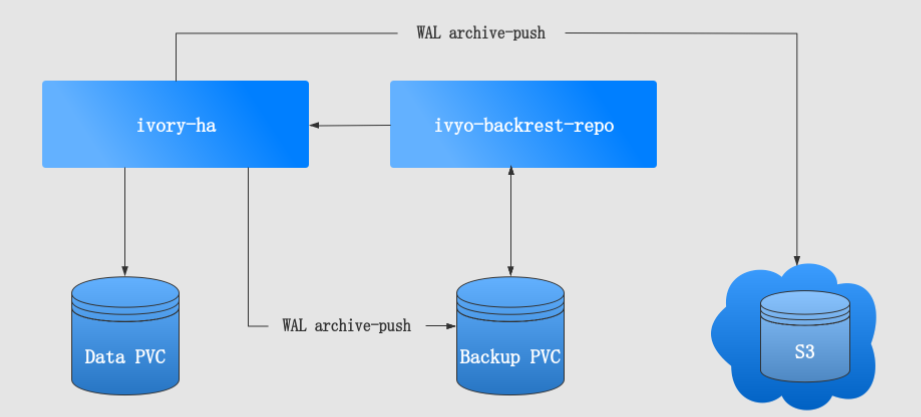

# Backup Management

When using the IvorySQL Operator, the answer to the question "do you take
backups of your database" is automatically "yes!"

The IvorySQL Operator uses the open source
[pgBackRest](https://pgbackrest.org) backup and restore utility that is designed
for working with databases that are many terabytes in size. As described in the
[tutorial](https://github.com/IvorySQL/ivory-operator/blob/master/docs/content/tutorial/backups.md), pgBackRest is enabled by
default as it permits the IvorySQL Operator to automate some advanced as well
as convenient behaviors, including:

- Efficient provisioning of new replicas that are added to the IvorySQL
cluster
- Preventing replicas from falling out of sync from the IvorySQL primary by
allowing them to replay old WAL logs
- Allowing failed primaries to automatically and efficiently heal using the
"delta restore" feature
- Serving as the basis for the cluster cloning feature
- ...and of course, allowing for one to take full, differential, and incremental
backups and perform full and point-in-time restores

Below is one example of how IVYO manages backups with both a local storage and a Amazon S3 configuration.

The IvorySQL Operator leverages a pgBackRest repository to facilitate the
usage of the pgBackRest features in an IvorySQL cluster. When a new IvorySQL
cluster is created, it simultaneously creates a pgBackRest repository.

You can store your pgBackRest backups in up to four different locations and using four different storage types:

- Any Kubernetes supported storage class
- Amazon S3 (or S3 equivalents like MinIO)
- Google Cloud Storage (GCS)
- Azure Blob Storage

IvorySQL is automatically configured to use the `pgbackrest archive-push` command
to archive the write-ahead log (WAL) in all repositories.

## Backups

IVYO supports three types of pgBackRest backups:

- Full: A full backup of all the contents of the IvorySQL cluster
- Differential: A backup of only the files that have changed since the last full backup
- Incremental: A backup of only the files that have changed since the last full, differential, or incremental backup

## Scheduling Backups

Any effective disaster recovery strategy includes having regularly scheduled
backups. IVYO enables this by managing a series of Kubernetes CronJobs to ensure that backups are executed at scheduled times.

Note that pgBackRest presently only supports taking one backup at a time. This may change in a future release, but for the time being we suggest that you stagger your backup times.

Please see the [backup management tutorial](https://github.com/IvorySQL/ivory-operator/blob/master/docs/content/tutorial/backup-management.md) for how to set up backup schedules
and configure retention policies.

## Restores

The IvorySQL Operator supports the ability to perform a full restore on a
IvorySQL cluster as well as a point-in-time-recovery. There are two types of
ways to restore a cluster:

- Restore to a new cluster
- Restore in-place

For examples of this, please see the [disaster recovery tutorial](https://github.com/IvorySQL/ivory-operator/blob/master/docs/content/tutorial/disaster-recovery.md)

## Deleting a Backup

{}
If you delete a backup that is *not* set to expire, you may be unable to meet
your retention requirements. If you are deleting backups to free space, it is
recommended to delete your oldest backups first.
{}

A backup can be deleted by running the [`pgbackrest expire`](https://pgbackrest.org/command.html#command-expire) command directly on the pgBackRest repository Pod or an Ivory instance.
